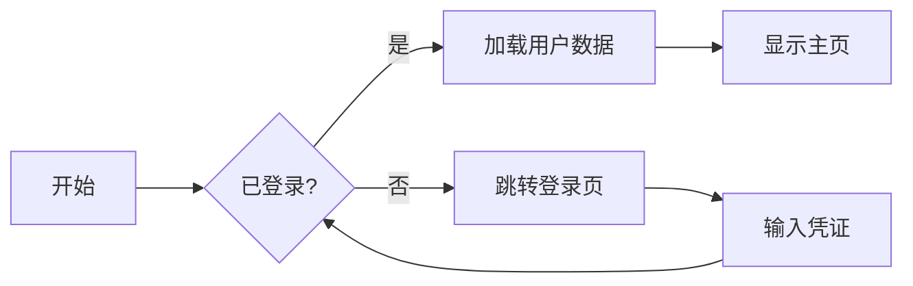
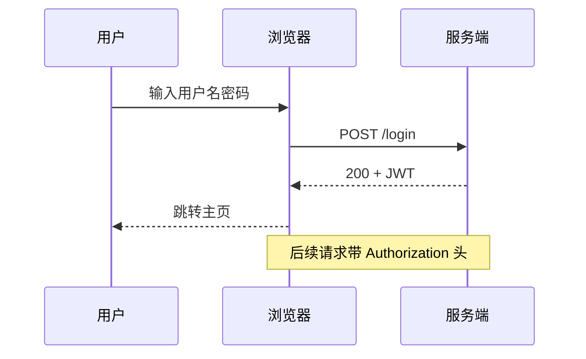
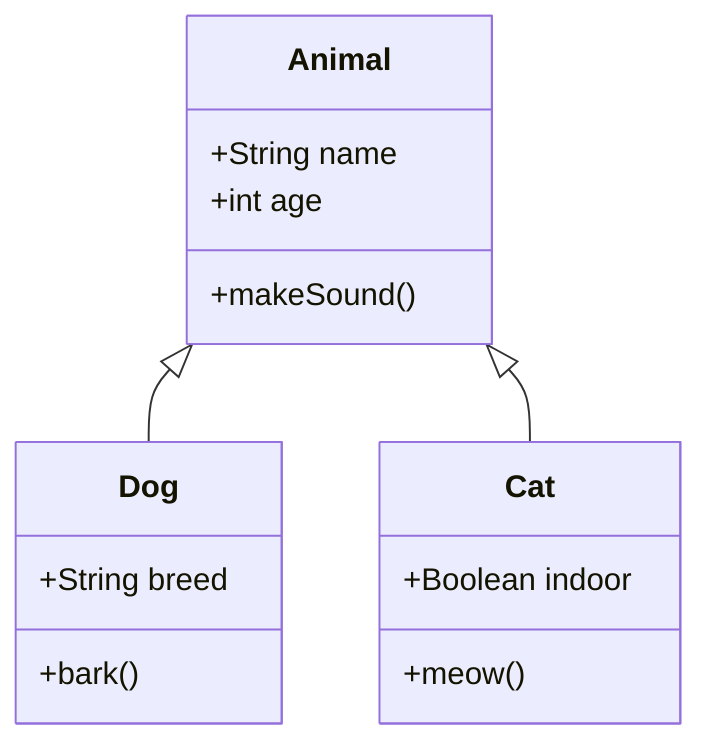
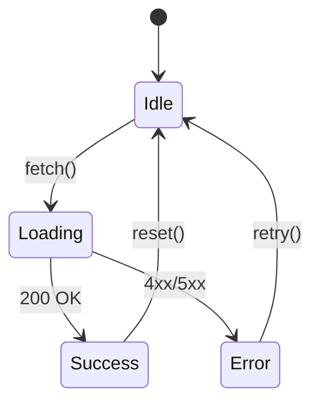
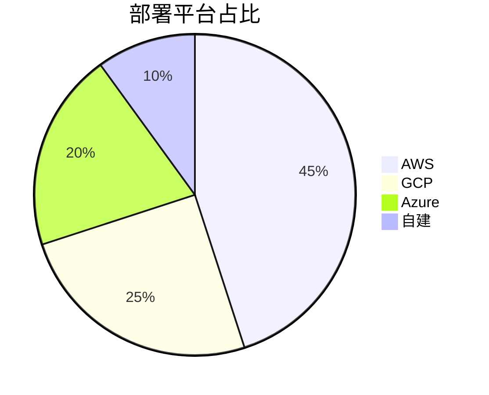
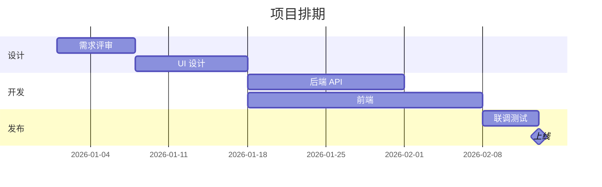
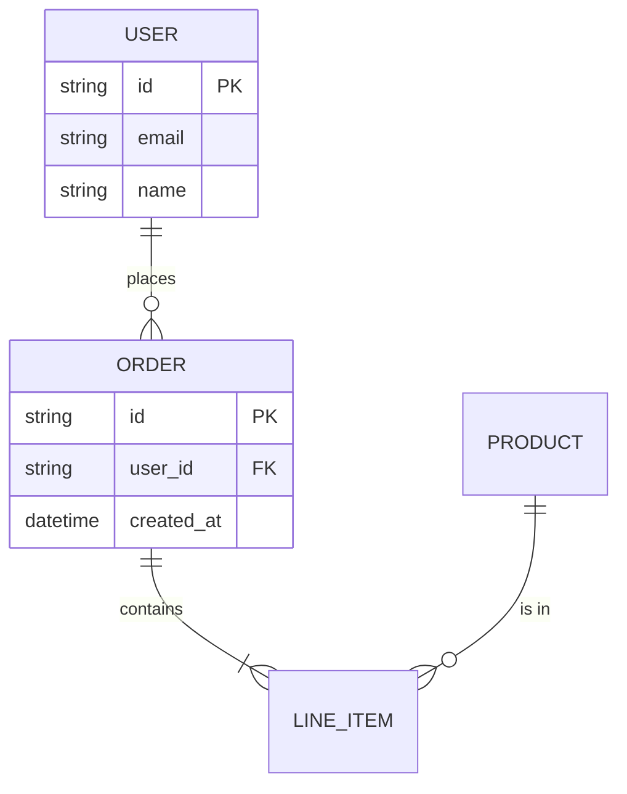

# Markdown Pro 全功能演示

> 这一个文件覆盖**所有**插件功能。打开后切「双栏」或「预览」,逐节往下滚,
> 同时用左侧 **Markdown 大纲** 跳转,你应该能验证编辑/渲染/同步/Lint 的全部行为。

---

## 一、基础排版

### 1.1 强调与行内元素

普通段落。**粗体**,*斜体*,***粗斜体***,~~删除线~~,`内联代码`,
H<sub>2</sub>O,E = mc<sup>2</sup>,以及 ==高亮== (markdown-it 默认不解析,会显示原样)。

### 1.2 引用与多级引用

> 一级引用:这一段应该有左侧竖线 + 灰色文本。
>
> > 二级引用:嵌套时颜色更浅。
> >
> > > 三级引用:再深一层。

### 1.3 列表

无序:

- 一
- 二
  - 二点一
  - 二点二
- 三

有序:

1. 第一
2. 第二
   1. 第二点一
   2. 第二点二
3. 第三

任务列表(GFM):

- [x] 已完成项
- [x] 也完成
- [ ] 待办
- [ ] 另一个待办

### 1.4 链接与脚注样式

行内 [VS Code 官网](https://code.visualstudio.com)、自动 https://example.com、邮箱 <noreply@example.com>。

引用式 [GitHub][gh] 跳转到下面定义。

[gh]: https://github.com "GitHub"

### 1.5 分隔线

上方 ↑

---

下方 ↓

---

## 二、表格

### 2.1 普通表格 + emoji + 内联代码

| 状态 | 命令 | 备注 |
| --- | --- | --- |
| ✅ 通过 | `npm test` | 12/12 用例 |
| ⚠️ 警告 | `npm run lint` | 3 处行尾空格 |
| ❌ 失败 | `npm run build` | TypeScript 报错 |

### 2.2 列对齐

| 左对齐 | 居中对齐 | 右对齐 |
| :--- | :---: | ---: |
| Apple | A | 1 |
| 比较长的内容 | 中 | 1234567 |
| 短 | BCD | 1.5 |

### 2.3 含链接的单元格

| 项目 | 仓库 |
| --- | --- |
| TypeScript | [microsoft/TypeScript](https://github.com/microsoft/TypeScript) |
| VS Code | [microsoft/vscode](https://github.com/microsoft/vscode) |

---

## 三、代码块(highlight.js GitHub 主题)

### 3.1 TypeScript

```typescript
interface User {
  id: number;
  name: string;
  email?: string;
}

async function getUser(id: number): Promise<User | null> {
  const res = await fetch(`/api/users/${id}`);
  if (!res.ok) return null;
  return res.json();
}
```

### 3.2 Python

```python
def fibonacci(n: int) -> list[int]:
    """Return the first n Fibonacci numbers."""
    if n <= 0:
        return []
    seq = [0, 1]
    while len(seq) < n:
        seq.append(seq[-1] + seq[-2])
    return seq[:n]

print(fibonacci(10))
```

### 3.3 Bash

```bash
#!/bin/bash
set -euo pipefail

for f in *.md; do
  echo "Processing $f..."
  pandoc -f markdown -t html -o "${f%.md}.html" "$f"
done
```

### 3.4 JSON / YAML

```json
{
  "name": "vscode-markdown-pro",
  "displayName": "Markdown Pro",
  "version": "0.0.1",
  "engines": { "vscode": "^1.85.0" },
  "categories": ["Other"]
}
```

```yaml
name: CI
on: [push, pull_request]
jobs:
  build:
    runs-on: ubuntu-latest
    steps:
      - uses: actions/checkout@v4
      - uses: actions/setup-node@v4
        with: { node-version: 20 }
      - run: npm ci && npm run compile
```

### 3.5 SQL

```sql
SELECT u.id, u.name, COUNT(o.id) AS order_count
FROM users u
LEFT JOIN orders o ON o.user_id = u.id
WHERE u.created_at >= '2026-01-01'
GROUP BY u.id, u.name
HAVING COUNT(o.id) > 0
ORDER BY order_count DESC
LIMIT 10;
```

### 3.6 无 lang 标签(自动识别)

```
const fs = require('fs');
fs.readFile('a.txt', 'utf8', (err, data) => console.log(data));
```

---

## 四、Mermaid 图表(本地 mermaid.min.js)

### 4.1 流程图



### 4.2 时序图



### 4.3 类图



### 4.4 状态图



### 4.5 饼图



### 4.6 甘特图



### 4.7 ER 图



---

## 五、KaTeX 数学公式(本地 katex)

### 5.1 行内

爱因斯坦质能方程 $E = mc^2$ 是相对论的基石。
复数 $z = a + bi$,其中 $i = \sqrt{-1}$。
二次方程 $ax^2 + bx + c = 0$ 的解为 $x = \frac{-b \pm \sqrt{b^2 - 4ac}}{2a}$。

### 5.2 块级

$$
\int_{-\infty}^{\infty} e^{-x^2} \, dx = \sqrt{\pi}
$$

$$
\zeta(s) = \sum_{n=1}^{\infty} \frac{1}{n^s} = \prod_{p \text{ prime}} \frac{1}{1 - p^{-s}}
$$

### 5.3 矩阵 + 求和

$$
A = \begin{pmatrix}
a_{11} & a_{12} & a_{13} \\
a_{21} & a_{22} & a_{23} \\
a_{31} & a_{32} & a_{33}
\end{pmatrix}
\quad
\lim_{n \to \infty} \sum_{k=1}^{n} \frac{1}{k^2} = \frac{\pi^2}{6}
$$

### 5.4 微积分

$$
\frac{d}{dx}\left[ \int_a^x f(t) \, dt \right] = f(x)
$$

### 5.5 希腊字母

$$
\alpha + \beta = \gamma, \quad \Sigma_{i=1}^{n} \theta_i = \pi, \quad \Omega \subset \mathbb{R}^n
$$

---

## 六、图片

### 6.1 远程图片


### 6.2 相对路径(本地)

> 在 `test-fixtures/` 工作区里打开有效;在仓库根目录单独打开 `sample.md` 时,
> 因为没有 `assets/` 文件夹,这张本地图会显示 broken。
> 想验证本地图,**用 test-fixtures workspace 测**。


### 6.3 带链接的图片

[](https://code.visualstudio.com)

---

## 七、Lint 触发(打开 Problems 面板看)

`Cmd+Shift+M` 打开 Problems 面板,以下应触发警告。

### 7.1 MD009 行尾多余空格

下一行末尾有 4 个空格:    
本行末尾也是。   

### 7.2 MD012 多个连续空行

上面一个空行,下面三个空行 ↓


↑ 应该有警告。

### 7.3 MD018 标题井号后无空格

#没空格的标题这一整行应该被标记
正常标题 ↓

## 7.3.1 这是正常 H2

### 7.4 MD001 标题层级跳跃

##### 直接跳到 H5(从上面 H3 开始)

### 7.5 MD034 裸 URL

这里直接放 https://example.com 应该被建议改成 `[text](url)` 或 `<url>`。

---

## 八、深层级大纲(测试 TreeView)

打开左侧「Markdown 大纲」面板,应能看到这一节有 4 层嵌套。点任一节标题应跳到对应行。

### 8.1 二级

#### 8.1.1 三级

##### 8.1.1.1 四级 A

##### 8.1.1.2 四级 B

#### 8.1.2 三级 B

### 8.2 二级 B

#### 8.2.1 三级 C

#### 8.2.2 三级 D

---

## 九、滚动同步压力测试

下面有大量内容,在「双栏」模式下编辑器滚动 ↔ 预览滚动 应保持同步。

### 9.1 一长段普通文本

人月神话讲到一个核心观点:**给已经延期的项目增加人手,只会让它更晚交付**。
原因是新成员需要时间熟悉代码、与团队成员沟通,这部分沟通成本随团队规模 N 平方级上升,
即使新成员立刻达到平均生产力,前期的减速也常常无法被弥补。Brooks 还指出"焦油坑"的比喻:
软件工程像史前的恐龙陷在焦油里,挣扎得越用力陷得越深。这两点合起来构成了软件工程
持续被低估的根源。

### 9.2 又一段

The right way to evaluate any tool isn't to ask whether it solves your problem,
but whether it changes what problems you have. New tools shift constraints — what
was hard becomes easy, what was easy becomes a different shape of difficult. The
question to ask of any new tool you're considering is: which of my current
problems would simply cease to exist?

### 9.3 又一长块代码

```typescript
import * as vscode from 'vscode';

export function activate(context: vscode.ExtensionContext) {
  const provider = new MarkdownEditorProvider(context);
  context.subscriptions.push(
    vscode.window.registerCustomEditorProvider(
      'markdownPro.editor',
      provider,
      {
        webviewOptions: { retainContextWhenHidden: true },
        supportsMultipleEditorsPerDocument: false
      }
    )
  );
}

class MarkdownEditorProvider implements vscode.CustomTextEditorProvider {
  constructor(private context: vscode.ExtensionContext) {}

  resolveCustomTextEditor(
    document: vscode.TextDocument,
    panel: vscode.WebviewPanel,
    token: vscode.CancellationToken
  ): void {
    panel.webview.options = { enableScripts: true };
    panel.webview.html = this.buildHtml(panel.webview);
    panel.webview.onDidReceiveMessage((msg) => {
      if (msg.type === 'edit') {
        const edit = new vscode.WorkspaceEdit();
        edit.replace(
          document.uri,
          new vscode.Range(0, 0, document.lineCount, 0),
          msg.text
        );
        vscode.workspace.applyEdit(edit);
      }
    });
  }

  private buildHtml(webview: vscode.Webview): string {
    return /* html */`<!DOCTYPE html><html>...</html>`;
  }
}
```

### 9.4 又一个 Mermaid

```mermaid
flowchart TB
  Start --> Decide{选择模式?}
  Decide -->|编辑| Editor[CodeMirror]
  Decide -->|预览| Preview[markdown-it 渲染]
  Decide -->|双栏| Both[左 CodeMirror + 右预览]
  Editor --> Done
  Preview --> Done
  Both --> Done
  Done --> [*]
```

### 9.5 表格

| 模块 | 文件 | LOC |
| --- | --- | --- |
| 入口 | `src/extension.ts` | ~30 |
| 自定义编辑器 | `src/editor/markdownEditor.ts` | ~210 |
| Webview | `src/webview/editor.ts` | ~360 |
| Renderer | `src/preview/renderer.ts` | ~70 |
| Lint | `src/lint/linter.ts` | ~110 |
| Outline | `src/outline/outlineProvider.ts` | ~80 |
| Edit Cmds | `src/edit/editCommands.ts` | ~125 |

### 9.6 公式

$$
\sum_{k=0}^{n} \binom{n}{k} a^{n-k} b^k = (a+b)^n
$$

### 9.7 又一段普通段落

最后一段。如果你滚到了这里,而预览也滚到了这一段,说明双栏滚动同步工作正常。
反之,如果只滚动了一边,说明 `data-source-line` 注入或者 scroll 监听有问题。

---

## 十、HTML 内嵌(markdown-it html: true)

<details>
<summary>点我展开</summary>

里面可以放 **任意** Markdown,*强调*、代码 `inline`、列表都正常。

- 1
- 2
- 3

</details>

<div style="padding: 12px; border: 1px solid #888; border-radius: 6px;">
  <strong>原生 HTML 块</strong> — 也能渲染,但要小心:不会被 highlight.js 高亮、KaTeX 也不处理。
</div>

---

*完。* 最后更新:2026-05-05
