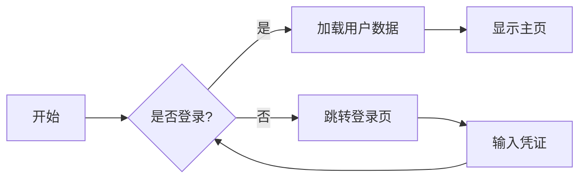
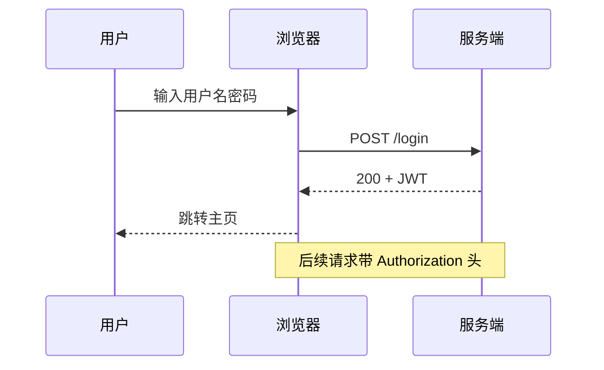
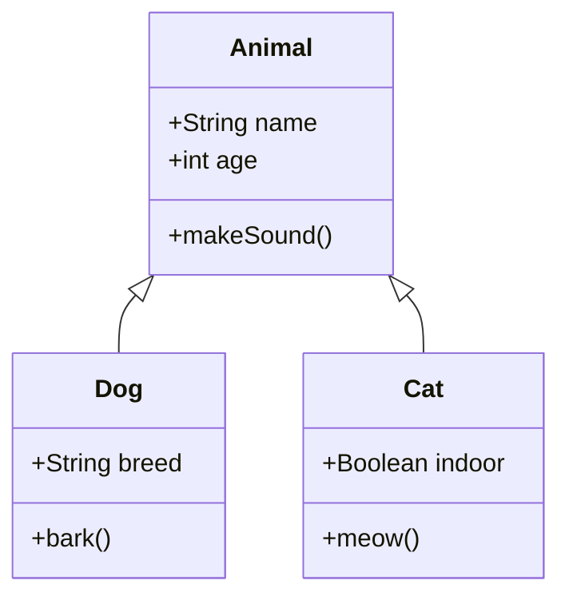
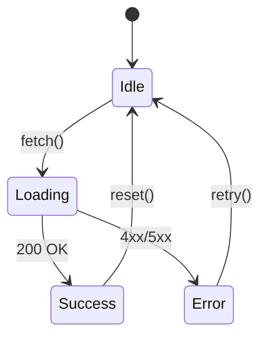
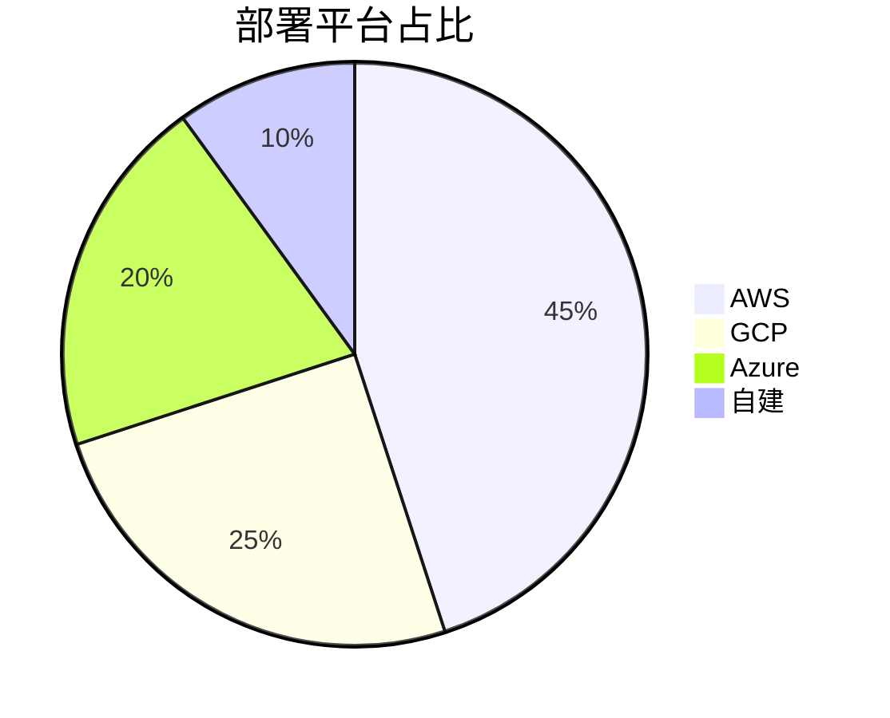
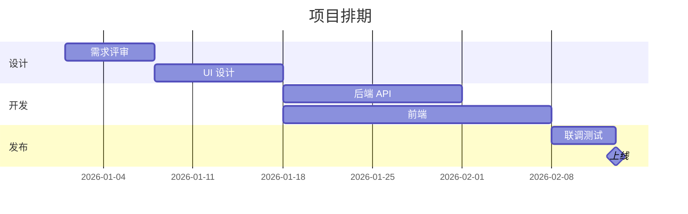

# Mermaid 图表测试

切到「双栏」或「预览」模式查看渲染效果。

## 流程图

```mermaid
graph LR
  A[开始] --> B{是否登录?}
  B -->|是| C[加载用户数据]
  B -->|否| D[跳转登录页]
  C --> E[显示主页]
  D --> F[输入凭证]
  F --> B
```

## 时序图

```mermaid
sequenceDiagram
  participant U as 用户
  participant W as 浏览器
  participant S as 服务端
  U->>W: 输入用户名密码
  W->>S: POST /login
  S-->>W: 200 + JWT
  W-->>U: 跳转主页
  Note over W,S: 后续请求带 Authorization 头
```

## 类图

```mermaid
classDiagram
  class Animal {
    +String name
    +int age
    +makeSound()
  }
  class Dog {
    +String breed
    +bark()
  }
  class Cat {
    +Boolean indoor
    +meow()
  }
  Animal <|-- Dog
  Animal <|-- Cat
```

## 状态图

```mermaid
stateDiagram-v2
  [*] --> Idle
  Idle --> Loading: fetch()
  Loading --> Success: 200 OK
  Loading --> Error: 4xx/5xx
  Success --> Idle: reset()
  Error --> Idle: retry()
```

## 饼图

```mermaid
pie title 部署平台占比
  "AWS" : 45
  "GCP" : 25
  "Azure" : 20
  "自建" : 10
```

## 甘特图

```mermaid
gantt
  title 项目排期
  dateFormat YYYY-MM-DD
  section 设计
    需求评审   :a1, 2026-01-01, 7d
    UI 设计    :a2, after a1, 10d
  section 开发
    后端 API   :b1, after a2, 14d
    前端       :b2, after a2, 21d
  section 发布
    联调测试   :c1, after b2, 5d
    上线       :milestone, after c1, 0d
```
