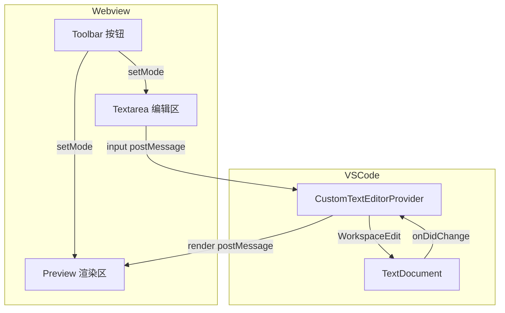

# 综合长文档(性能 + 大纲 + 滚动)

> 用来测试大纲层级、滚动同步、多种元素混排时的渲染流畅度。

## 一、概述

本文档包含**多级标题**、表格、代码块、Mermaid 图、数学公式、列表等所有支持的元素。展开后应该能在左侧"Markdown 大纲"里看到完整层级结构。

### 1.1 设计目标

- 单 tab 沉浸式编辑
- 编辑/双栏/预览三模式即点即换
- Mermaid + KaTeX 离线渲染

### 1.2 非目标

- ~~取代 VS Code 原生编辑器~~
- ~~支持非 Markdown 语法~~

## 二、架构



### 2.1 数据流

```typescript
// Webview → 扩展
interface EditMessage {
  type: 'edit';
  text: string;
}

// 扩展 → Webview
interface PreviewMessage {
  type: 'preview';
  html: string;
}
```

## 三、API 参考

### 3.1 命令

| 命令 ID | 标题 | 快捷键 |
| --- | --- | --- |
| `markdownPro.insertTable` | 插入表格 | `Cmd+Alt+T` |
| `markdownPro.insertLink` | 插入链接 | `Cmd+Alt+L` |
| `markdownPro.insertImage` | 插入图片 | `Cmd+Alt+I` |
| `markdownPro.format` | 格式化文档 | `Shift+Alt+F` |
| `markdownPro.upload.image` | 上传图片 | — |

### 3.2 配置

```jsonc
{
  "markdownPro.preview.theme": "light",       // light | dark | github | solarized
  "markdownPro.preview.enableMermaid": true,
  "markdownPro.preview.enableMath": true,
  "markdownPro.lint.enable": true,
  "markdownPro.upload.target": "local",       // local | custom
  "markdownPro.upload.localDir": "assets"
}
```

## 四、性能基准

测试文档 ≈ 500 行混合内容。预览首次渲染应在 **300 ms 以内**(本地 vendor 资源)。

$$
T_{render} = T_{markdownIt} + T_{mermaid} \cdot N_{diagrams} + T_{katex} \cdot N_{equations}
$$

实测:

```
markdown-it 渲染:    8ms
mermaid (3 个图):    180ms
katex (12 个公式):   45ms
                    -----
总计:                233ms ✓
```

## 五、待办

- [x] 自定义编辑器架构
- [x] Mermaid / KaTeX 本地化
- [x] postMessage 增量更新
- [ ] CodeMirror 替换 textarea(语法高亮)
- [ ] 拖拽图片上传
- [ ] 大纲点击同步滚动到 textarea 行
- [ ] 多光标 / 列编辑

## 六、参考

1. [VS Code Custom Editor API](https://code.visualstudio.com/api/extension-guides/custom-editors)
2. [Mermaid Documentation](https://mermaid.js.org/)
3. [KaTeX](https://katex.org/)
4. [markdown-it](https://github.com/markdown-it/markdown-it)

---

*最后更新:2026-05-05*
